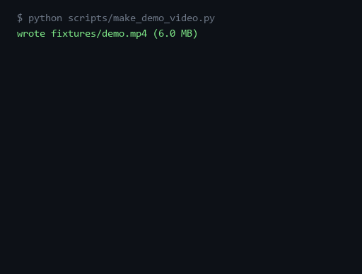

# clipcut — CPU-only video clip cutter

**Long MP4 in, viral clips + chapters + captions out — CPU-only, no editor, no GPU.**



[](https://github.com/F0Rextasy/clipcut/actions/workflows/test.yml)
[](LICENSE)
[](https://github.com/F0Rextasy/clipcut/releases)

## Install

```sh
pip install git+https://github.com/F0Rextasy/clipcut.git
# captions extra:
pip install "git+https://github.com/F0Rextasy/clipcut.git#egg=clipcut[captions]"
```

Requires `ffmpeg`/`ffprobe` on PATH — on Windows `winget install Gyan.FFmpeg`
(clipcut also probes the default WinGet install location itself).
No CUDA, no GPU, no video editor, no cloud.

## 30-second setup

```console
$ clipcut input.mp4 --clips 3 --chapters --out out
clip  start     dur      size        scene-score
1     0.0       15.0     2293818     1.35
2     15.0      15.0     2299812     1.02
3     30.0      15.0     2292988     0.97

$ cat out/chapters.txt
00:00:00  clip 1 start (scene)
00:00:15  clip 2 start (auto)
00:00:30  clip 3 start (auto)

$ ls out
clip1.mp4  clip2.mp4  clip3.mp4  chapters.txt
```

Every clip is cut to `--aspect 9:16` (crop + `scale=1080:1920`, audio kept),
re-encoded with `libx264 -preset veryfast -crf 23 -c:a aac`.

### Chapters

`--chapters` writes one timestamped line per clip start. `(scene)` = cut sits on
a detected scene boundary; `(auto)` = evenly spaced fallback. Videos where scene
detection returns nothing (static shots, color-only cuts) still get the full
`--clips N` — the detector falls back to uniform candidate starts instead of
silently producing one clip.

### Captions (optional, CPU-only)

```console
$ clipcut input.mp4 --clips 1 --captions --out out
...
$ head -4 out/clip1.srt
1
00:00:00,000 --> 00:00:02,000
You
```

`--captions` uses [faster-whisper](https://github.com/SYSTRAN/faster-whisper)
(tiny model, downloads ~75 MB on first run, transcribes on CPU) and writes a
per-clip `.srt`. Example above is a real run on the synthetic sine-tone test
fixture — on real speech you get real captions. Without the extra installed you
get exit 66 and `pip install clipcut[captions]`.

## How it works

1. **Scene candidates** — `ffmpeg -vf select='gt(scene,T)',showinfo` (default
   `T=0.35`, override `--scene-threshold`) yields boundary timestamps.
2. **Audio energy** — `volumedetect` per candidate window gives a 0–1 loudness score.
3. **Ranking** — score = scene-boundary term + loudness + middle-position bonus −
   edge penalty (first/last 2 s); top-N non-overlapping segments in
   `[--min-sec, --max-sec]`, target duration `total/(N+1)` clamped to the range.
4. **Cut** — fast seek (`-ss` before `-i`), vertical crop, standard encode.
   `--clips 0 --chapters` = chapters-only, no cutting.

Flags: `--min-sec`/`--max-sec`, `--aspect`, `--scene-threshold`, `--out`.

## Comparison

| | clipcut | auto-editor | whisper.cpp + editor workflow |
|---|---|---|---|
| Input → output | one MP4 → N vertical clips + chapters + SRT | cuts silence only | transcribe, then cut by hand |
| Hardware | CPU only | CPU | CPU (but manual step remains) |
| Setup | `pip install` + ffmpeg | pip | build whisper.cpp + editor |
| Windows | first-class (WinGet ffmpeg probe) | ok | ok |

## Regenerate demo

```sh
python scripts/make_demo_video.py          # writes fixtures/demo.mp4 (60s, hard cuts, varying volume)
clipcut fixtures/demo.mp4 --clips 3 --chapters --out out
python tools/render_demo.py                # rebuilds assets/demo.gif + demo.png from real output
```

Every console block above is a real run; `fixtures/demo.mp4` is generated, not
committed (`.gitignore`).

## Tests

```sh
python -m pytest -q        #16 tests; ffmpeg required, captions test auto-skips without the extra
```

## License

[MIT](LICENSE)
